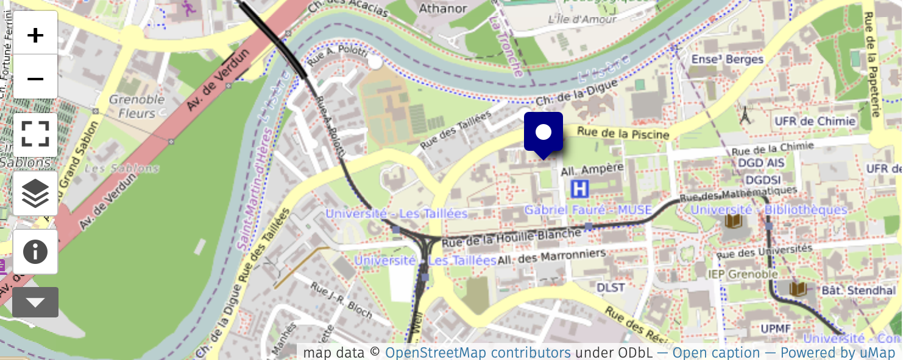

# Practical Information 

## When 

 - **Start:** Monday 10 March 2025 13:00 
 - **End:** Thursday 13 March 2025 14:00 

## Where 

The event will be held on-site at the *Institute for Environmental Geosciences* (IGE) in Grenoble, in the MCP building, rooms 117-118. 

[See the map in action](http://umap.openstreetmap.fr/en/map/anonymous-edit/655503:LtKbIAl24v-TySSBzXbliPoKqrk)

## Food and accommodation

Participants are expected to organize their travel plans and acccomodation on their own. Lunch will be provided to on-site participants. A social dinner will be organize on Wednesday 12 March.   

## Zoom links for remote participants 

For Wednesday 12 March [here](https://univ-grenoble-alpes-fr.zoom.us/j/98351688047?pwd=RuHGu2DUpZbJcbVYtkOkXZrDQCSrQf.1)
